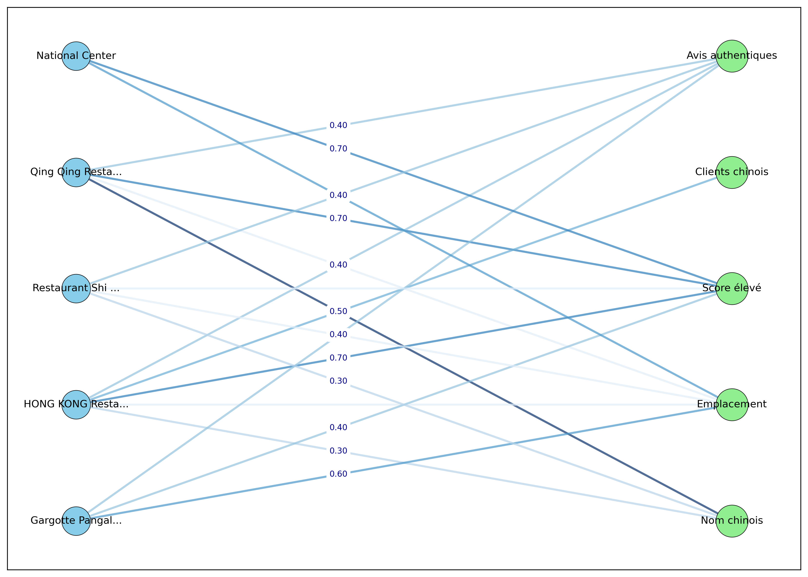

# Classification des restaurants chinois
## Objectif: classer les restaurants en 3 catégories
- Vraiment chinois
- Moyennement chinois
- Pas chinois
## Méthode: 
 - Utilisation d'un graphe biparti G\[X, Y\],non orienté, simple, sans boucle :  où X est l'ensemble des restaurants et Y l'ensemble des attributs(nom, emplacement, score, type, menu).
 - Réalisation d'un test de chi 2: pour évaluer si certains attributs sont significativement liés à des vrais restaurants chinois

## ETAPE DETAILLEES

### 1. Création d'un graphe biparti  pondéré

Soit G un graphe simple, non orienté, sans boucle et biparti : G\[X, Y\] où  :
- X est l'ensemble des restaurans rk : $X = \{r_1, r_2, ...., r_k\};$
- Y est l'ensemble des attributs qui reflète la propriété chinoise:
		- Nom chinois $x_1$
		- Emplacement fréquenté par des chinois $x_2$
		- Clients chinois $x_3$ 
		- Avis des sur les plats qui reflète l'authenticité des plats chinois $x_4$
		- Score(rating) $x_5$
	$Y = \{x_1, x_2, x_3, x_4, x_5\}$
Soit p la ponderation, et p app \[0,1\].
Les arcs de G sont les liens pondérés entre les restaurant et caractéristique
Ainsi, si il existe $r_k$ app X , il existe $x_k$ app Y tq, $r_k$ et $x_k$ n'est pas adjacent alors p = 0;
p représente alors la probabilité pour qu'un restaurants est lié à un attributs de Y.
Donc G n'est pas forcement un graphe complet, sinon chaque restaurants auront un taux de probabilité élévé pour être un restaurant  chinois.

Voici un code en python pour visualiser ce graphe (ex : 5  restaurants)
Les informations sur les 5 restaurants sont stockées dans un fichier .json (restaurant.json)
 __ Veuillez assurer que vous avez matplotlib et networkx pour exécuter ce programme de visualisation du graphe
 
 __ Veuillez mettre le fichier restaurant_extrait.json dans la même repertoire que ce code
#### Graph construction : voir le fichier graph.py pour avoir le code

```python
import json
import networkx as nx
import matplotlib.pyplot as plt
import re
from math import radians, sin, cos, sqrt, atan2

# Fonction pour calculer la distance haversine (en km)
def haversine_distance(lat1, lon1, lat2, lon2):
    R = 6371  # Rayon de la Terre en km
    dLat = radians(lat2 - lat1)
    dLon = radians(lon2 - lon1)
    a = sin(dLat / 2) ** 2 + cos(radians(lat1)) * cos(radians(lat2)) * sin(dLon / 2) ** 2
    c = 2 * atan2(sqrt(a), sqrt(1 - a))
    return R * c

# Fonctions pour calculer les probabilités p
def name_chineseness(name):
    positive_keywords = ['chinois', 'china', 'qing', 'dragon', 'panda', 'jasmine', 'wan', 'lotus', 'jade', 'shi fu', 'hao', 'rouge', 'empire', 'dynasty', 'tsang', 'chinese', 'hong kong', 'fleur', 'orient', 'oriental']
    negative_keywords = ['malagasy', 'gargotte', 'sushi', 'thai']
    score = 0
    if re.search(r'[\u4e00-\u9fff]', name):  # Caractères chinois
        score += 0.7
    name_lower = name.lower()
    for keyword in positive_keywords:
        if keyword in name_lower:
            score += 0.3
            break
    for keyword in negative_keywords:
        if keyword in name_lower:
            score -= 0.2
            break
    return max(0, min(1, score))

def location_chineseness(lat, lon, vicinity):
    neighborhoods = [
        {'name': 'Behoririka', 'lat': -18.9000, 'lon': 47.5200, 'score': 0.6},
        {'name': 'Analakely', 'lat': -18.9100, 'lon': 47.5250, 'score': 0.5},
        {'name': 'Andrahavoangy', 'lat': -18.8900, 'lon': 47.5100, 'score': 0.5},
        {'name': 'Ankorondrano', 'lat': -18.8700, 'lon': 47.5300, 'score': 0.5},
        {'name': 'Ivato', 'lat': -18.8000, 'lon': 47.4800, 'score': 0.6}
    ]
    proximity_radius = 2  # km
    score = 0.1  # Par défaut
    for neighborhood in neighborhoods:
        distance = haversine_distance(lat, lon, neighborhood['lat'], neighborhood['lon'])
        if distance <= proximity_radius:
            score = neighborhood['score']
            break
       	if neighborhood['name'].lower() in vicinity:
       	    score = neighborhood['score']
       	    break 
    return score

def authors_chineseness(authors):
    if not authors or authors.strip() == 'Unknown':
        return 0
    chinese_names = ['li', 'chen', 'wang', 'zhang', 'liu', 'yang', 'huang', 'ying']
    authors_lower = authors.lower()
    score = 0
    for name in chinese_names:
        if name in authors_lower:
            score += 0.5
            break
        if re.search(r'[\u4e00-\u9fff]', authors_lower):
            score += 0.7
            break
    return min(score, 1)

def text_chineseness(text):
    if not text or text.strip() == '':
        return 0
    positive_keywords =['yum cha', 'dim sum', 'canard laqué', 'mapo tofu', 'xiaolongbao', 'authentique chinois','cuisine sichuanaise', 'cuisine cantonaise', 'wonton', 'raviolis chinois', '飲茶', 'authentique', 'authentic', 'tofu', 'noodle','noodles', 'chinois', 'chinese', 'cantonais', 'the', 'pao', 'tea', 'nouilles', 'cantonese', 'cantonese rice']
    negative_keywords = ['malagasy', 'vazaha', 'ravitoto']
    score = 0
    text_lower = text.lower()
    for keyword in positive_keywords:
        if keyword in text_lower:
            score += 0.4
            break
    for keyword in negative_keywords:
        if keyword in text_lower:
            score -= 0.2
            break
    return max(0, min(1, score))

def rating_chineseness(rating):
    if not rating or rating.strip() == '':
        return 0
    ratings = [float(r) for r in rating.split('.') if r.strip().isdigit()]
    if not ratings:
        return 0
    avg_rating = sum(ratings) / len(ratings)
    if avg_rating >= 4:
        return 0.7
    elif avg_rating >= 3:
        return 0.4
    else:
        return 0.1

# Fonction pour abréger les noms longs
def shorten_name(name, max_length=15):
    return (name[:max_length] + '...') if len(name) > max_length else name

# Charger les données depuis data.json
try:
    with open('restaurant_extrait.json', 'r', encoding='utf-8') as f:
        data = json.load(f)
    restaurants = data[0]['restaurants']
except FileNotFoundError:
    print("Erreur : Le fichier restaurant_extrait.json n'a pas été trouvé.")
    exit(1)
except json.JSONDecodeError:
    print("Erreur : Le fichier restaurant_extrait.json est mal formaté.")
    exit(1)
except KeyError:
    print("Erreur : La structure du JSON ne contient pas 'restaurants'.")
    exit(1)

# Créer le graphe biparti
G = nx.Graph()

# Ensembles X (restaurants) et Y (attributs)
X = [r['name'] for r in restaurants]
Y = ['Nom chinois', 'Emplacement', 'Clients chinois', 'Avis authentiques', 'Score élevé']
attributes = ['name', 'location', 'authors', 'text', 'rating']

# Ajouter les sommets
G.add_nodes_from(X, bipartite=0)  # Restaurants
G.add_nodes_from(Y, bipartite=1)  # Attributs

# Ajouter les arcs avec poids p
for i, restaurant in enumerate(restaurants):
    r_name = restaurant['name']
    scores = [
        name_chineseness(restaurant['name']),
        location_chineseness(restaurant['latitude'], restaurant['longitude'], restaurant['vicinity']),
        authors_chineseness(restaurant['all_authors']),
        text_chineseness(restaurant['all_text']),
        rating_chineseness(restaurant['all_rating'])
    ]
    for j, score in enumerate(scores):
        if score >= 0.1:  # Arc existe si p >= 0.1 pour réduire le bruit
            G.add_edge(r_name, Y[j], weight=score)

# Visualisation
plt.figure(figsize=(14, 10), facecolor='white')  # Taille plus grande, fond blanc

# Disposition bipartie
pos = nx.bipartite_layout(G, X, scale=1.5)

# Dessiner les sommets
nx.draw_networkx_nodes(
    G, pos, nodelist=X, node_color='#87CEEB', node_shape='o', node_size=800,
    edgecolors='black', linewidths=0.5, label='Restaurants'
)
nx.draw_networkx_nodes(
    G, pos, nodelist=Y, node_color='#90EE90', node_shape='o', node_size=1000,
    edgecolors='black', linewidths=0.5, label='Attributs'
)

# Dessiner les arcs avec une échelle de couleur basée sur le poids
edges = G.edges(data=True)
weights = [d['weight'] for u, v, d in edges]
nx.draw_networkx_edges(
    G, pos, edge_color=weights, edge_cmap=plt.cm.Blues, width=2,
    edge_vmin=0, edge_vmax=1, alpha=0.7
)

# Dessiner les étiquettes des poids pour p >= 0.3
edge_labels = {(u, v): f"{d['weight']:.2f}" for u, v, d in edges if d['weight'] >= 0.3}
nx.draw_networkx_edge_labels(
    G, pos, edge_labels=edge_labels, font_size=8, font_color='darkblue',
    label_pos=0.6, rotate=False
)

# Dessiner les étiquettes des sommets (noms abrégés pour restaurants)
labels = {node: shorten_name(node) for node in X}
labels.update({node: node for node in Y})
nx.draw_networkx_labels(G, pos, labels=labels, font_size=10, font_weight='normal')


# Sauvegarder l'image
plt.savefig('bipartite_graph.png', dpi=300, bbox_inches='tight', facecolor='white')
plt.show()
```

On obtien une visualisation graphique (matplotlib) comme suit lorsqu'on execute le programme
 

### 2. Réalisation d'un test de Chi²  et prise de décision pour la classification

#### Définition test de Chi² 
Le test du **Chi² (khi-deux)** est une méthode statistique utilisée pour évaluer si les données observées s’écartent significativement d’une distribution attendue, sous une hypothèse nulle.

#### Utilité du test de Chi² dans ce cas
1. **Validation de la cohérence des scores** :
   - Le test de Chi² permet de comparer les scores observés pour chaque paramètre (e.g., `name_chineseness_score = 1.0`, `location_chineseness_score = 0.7`) à une distribution attendue pour chaque classe. Par exemple :
     - Pour "Vraiment chinois", on attend des scores élevés pour `name` (e.g., 0.8) et `text` (e.g., 0.8).
     - Pour "Pas chinois", on attend des scores bas (e.g., 0.2).
   - Un faible score Chi² pour une classe indique que les scores observés sont proches de ceux attendus, renforçant la confiance dans cette classification.

2. **Classification basée sur la distribution** :
   - Plutôt que de se fier uniquement à une somme pondérée des scores (e.g., `(name * 0.3 + text * 0.4 + ...)`), le test de Chi² évalue la "ressemblance" globale des scores à un modèle attendu pour chaque classe. Cela peut capturer des patterns plus complexes, par exemple un restaurant avec un score `text` faible mais un score `name` très élevé, qui pourrait quand même être "Vraiment chinois".

3. **Approche statistique robuste** :
   - Le test fournit une base statistique pour la classification, ce qui est utile si vous voulez justifier les décisions avec un critère objectif, notamment dans un contexte où les données sont nombreuses ou où la classification doit être validée scientifiquement.

4. **Gestion des incertitudes** :
   - Dans des cas où les scores sont ambigus (e.g., scores moyens pour plusieurs paramètres), le Chi² peut aider à choisir la classe la plus probable en mesurant l’écart par rapport à des profils attendus, plutôt que de dépendre de seuils arbitraires (e.g., `>= 0.7`).

#### Distributions des scores attendus

Nous définissons les scores attendus pour chaque classe en fonction des connaissances du domaine :

- **Vraiment chinois**:
    - name: 0.8 (e.g., contains Chinese characters or explicit terms like "Qing").
    - location: 0.6 (e.g., in a central area like Behoririka).
    - text: 0.8 (e.g., mentions authentic dishes like "yum cha").
    - authors: 0.5 (e.g., some Chinese-sounding names).
    - rating: 0.4 (ratings less critical).
- **Moyennement chinois**:
    - name: 0.5 (e.g., generic Asian terms like "Wok").
    - location: 0.4 (e.g., in a commercial area).
    - text: 0.5 (e.g., mentions fusion dishes like "General Tao").
    - authors: 0.3 (e.g., mixed names).
    - rating: 0.4.
- **Pas chinois**:
    - name: 0.2 (e.g., local terms like "Gargotte").
    - location: 0.2 (e.g., outside key areas).
    - text: 0.2 (e.g., mentions non-Chinese dishes).
    - authors: 0.2 (e.g., no Chinese names).
    - rating: 0.4.

#### Calcule du chi - 2

La statistique du Chi-carré est calculée comme suit :

$X²=sum((O_i - E_i)²)/(E_i)$
Où:

- $O_i$: Score observé pour le paramètre i (par exemple, nom_score_chinois).
- $E_i$​: Score attendu pour le paramètre i pour une classe donnée.
- Pour éviter la division par zéro, nous ajouterons une petite constante (par exemple, 0,01) à $E_i$​ si elle est nulle.
- Nous calculons le χ² pour chaque classe et choisissons la classe ayant le χ² le plus faible, indiquant le meilleur ajustement.
