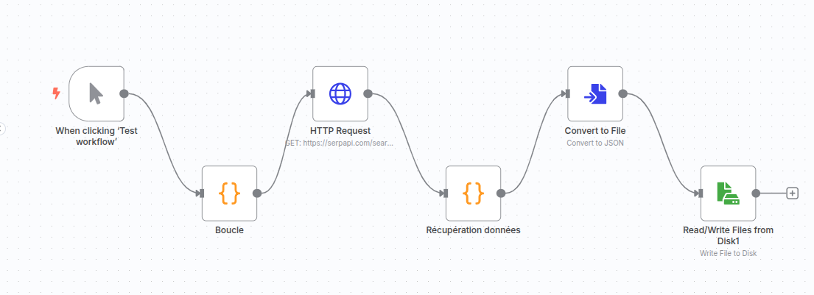
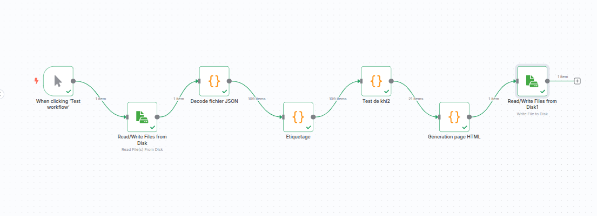
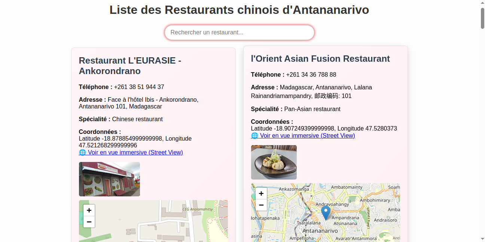

# exam1-2.0
nouvelle version de l'examen précédent


# 🥡 Détection des vrais restaurants chinois à Antananarivo via n8n + SerpApi

## 🎯 Objectif

Ce projet vise à **récupérer automatiquement une liste de restaurants à Antananarivo via Google Maps** (en utilisant **SerpApi**), puis à **identifier les véritables restaurants chinois** à partir de plusieurs critères (nom, type, avis, note).

Le résultat final est une **page HTML** générée automatiquement, listant uniquement les vrais restaurants chinois.

> ⚙️ Le projet repose sur l'outil **n8n** pour orchestrer les workflows.

---
## Quelques aperçu : 
Premier wokflow : 

Deuxième wokflow :



## 🧠 Représentation : Graphe orienté

- **Nœuds** : tâches à effectuer (requête, extraction, traitement…)
- **Arêtes** : flux de données entre les nœuds

---

## 🏗️ Architecture du projet

### 🔁 Premier workflow : Récupération et sauvegarde des données JSON

Objectif : récupérer les données depuis SerpApi et les sauvegarder localement.

- ✅ Extraction des restaurants chinois à Antananarivo
- ✅ Informations obtenues : nom, type, contact, adresse, rating, etc.
- ✅ 105 restaurants extraits au total

#### Principaux nœuds :
1. **Déclencheur** : début du workflow  
2. **Code (pagination)** : génère les paramètres de pagination  
3. **Requête HTTP** : envoie les requêtes vers SerpApi  
4. **Code (nettoyage et tri)** : filtre les champs utiles  
5. **Convertir en fichier JSON**  
6. **Écriture sur disque** : sauvegarde du fichier `.json`

#### Schéma :


#### Schéma :

[Déclencheur]  
│  
▼  
[Code : URL + params]  
│  
▼  
[Requête HTTP (SerpApi)]  
│  
▼  
[Code : nettoyage et tri JSON]  
│  
▼  
[Convertir JSON en fichier]  
│  
▼  
[Écriture sur le disque (.json)]


---

### 📊 Deuxième workflow : Classification et visualisation

Objectif : filtrer les **vrais restaurants chinois** parmi les 105, à l’aide du **test de khi²**, puis générer un fichier HTML.

#### Principaux nœuds :
1. **Déclencheur**
2. **Lire fichier JSON** : lit les données du disque
3. **Décoder JSON (base64 → objet JSON)**
4. **Étiquetage** : ajoute des attributs binaires par critère
5. **Test de khi²** :
   - Table de contingence entre chaque critère et `vrai`
   - Garde les colonnes **statistiquement significatives** (`p < 0.05`)
   - Sélectionne les restaurants où les critères significatifs sont majoritairement positifs
6. **Génération du HTML**

#### Schéma :

[Déclencheur]  
│  
▼  
[Lire fichier JSON depuis le disque]  
│  
▼  
[Décoder le fichier JSON (base64 → JSON)]  
│  
▼  
[Étiquetage par critères]  
│  
▼  
[Test de khi² (filtrage statistique)]  
│  
▼  
[Génération HTML (carte, table, recherche)]  
│  
▼  
[Écriture du fichier HTML final]


---

## 📌 Variables utilisées (données descriptives) :
- `nom` : nom du restaurant
- `type` : spécialité ou catégorie
- `rating` : note moyenne
- `review` : nombre d’avis

## ✅ Critères de décision (attributs binaires) :
- `aCaractereChinois` : le nom contient des caractères chinois (`\u4e00-\u9fff`)
- `contientChinoisDansNom` : le mot “chinois” est présent dans le nom
- `estAsiatique` : le type contient “asian” ou “chinese”
- `ratingOk` : note moyenne ≥ 4
- `avisSuffisants` : nombre d’avis ≥ 5

Un restaurant est considéré comme **vrai chinois** (`vrai = 1`) si :

aCaractereChinois == 1  
OU contientChinoisDansNom == 1  
OU (ratingOk == 1 ET avisSuffisants == 1)

---

## 📈 Analyse statistique : Test de khi² (chi-square)

Le test de khi² permet de **mesurer l'association** entre chaque critère binaire et la variable cible `vrai`.

Il répond à des questions comme :
- Est-ce que le fait que le **nom contienne “chinois”** est **significativement corrélé** au fait d’être un vrai restaurant chinois ?
- Est-ce que les **caractères chinois dans le nom** sont statistiquement pertinents ?
- Est-ce que les **restaurants bien notés (≥ 4)** sont plus souvent de vrais restaurants chinois ?

Les **critères significatifs** sont retenus pour le filtrage final.

---

## 🌐 Résultat

Une page **`restaurants.html`** est générée automatiquement et contient :
- Une table filtrée
- Une recherche intégrée
- Des coordonnées GPS (le cas échéant)

  Représentation de la page HTML : 
  

> Vous trouverez ce fichier HTML dans le répertoire d'exécution de **n8n**, après avoir lancé le **deuxième workflow**.

---

## 🚀 Comment exécuter le projet

1. Installer `n8n` globalement :
   ```bash
   npm install -g n8n

2. Importer les workflw dans votre n8n , puis executez-les.

#### Je vous remercie d'avoir lu jusqu'à la fin.

