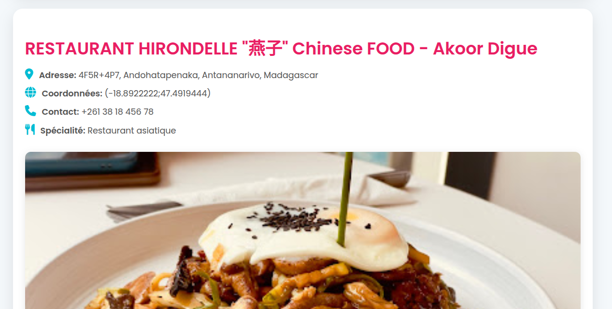

# 📡 My Workflow — Restaurants Chinois à Antananarivo 🇲🇬

Ce workflow **n8n** permet d'extraire automatiquement des données depuis l'API Apify concernant des restaurants, de filtrer ceux qui sont chinois avec une bonne note, puis de générer une page HTML stylisée présentant ces établissements.

---

## 🔁 Fonctionnement du Workflow

### 🧩 Étapes du workflow :

1. **🟢 Déclencheur (Manual Trigger)**  
   Lance manuellement le workflow depuis l’interface n8n.

2. **🌐 Requête HTTP – Apify API**  
   Récupère les données d’un dataset Apify :
   - URL utilisée :  
     `https://api.apify.com/v2/datasets/oadgYRWCp0mG1FAgw/items?format=json&clean=true`

3. **🛠️ Extraction des Données**  
   Le nœud `Extract data` transforme les objets bruts en un format plus lisible avec :
   - `nom`, `adresse`, `contact`, `lat`, `lon`, `specialité`, `image`, `note`, `site web`.

4. **🔍 Filtrage des Restaurants Chinois**  
   Le nœud `Filtrage` garde uniquement :
   - Les restaurants contenant **"chinois"** ou **"chinese"** dans leur nom ou spécialité.
   - Ceux ayant une **note ≥ 4**.

5. **🖥️ Génération d’une page HTML stylisée**  
   Le nœud `Code2` génère une page `restaurants.html` contenant :
   - Une carte stylisée de chaque restaurant.
   - Une mise en page responsive, moderne et épurée.
   - Utilisation de Google Fonts, Font Awesome, animations CSS.

---

## 🎨 Aperçu du HTML

Voici un aperçu du style :

- ✅ **Responsive** (s’adapte aux écrans mobiles)
- 🎨 **Design élégant** (box-shadow, hover effects)
- 📍 Affiche l’adresse, coordonnées GPS, spécialité, contact
- 🖼️ Affiche une image 3D si disponible
- 📍 Peut inclure les coordonnées sur une carte (préparation possible via JS)

---

## 📁 Fichier généré

- **Nom** : `restaurants.html`
- **Format** : HTML encodé en base64
- **Téléchargement** : possible via un autre nœud `Write Binary File` ou envoi par email/s3/ftp…

---

## 🛠️ Pré-requis

- Une instance **n8n** fonctionnelle (auto-hébergée ou via [n8n.cloud](https://n8n.io))
- Connexion internet pour récupérer les données d’Apify

---

## 📌 Objectif

Ce workflow peut être utile pour :
- Mettre à jour automatiquement une page web répertoriant les meilleurs restaurants chinois à Antananarivo
- Intégrer dans un projet de tourisme ou guide culinaire
- Générer des documents statiques à partager

---

## 🧠 Astuces

- Tu peux modifier le filtre pour inclure d’autres types de cuisines.
- Ajoute un nœud `Google Maps Static API` ou Leaflet si tu veux inclure une vraie carte.
- Intègre un `Email node` pour envoyer le fichier HTML automatiquement.

---

## 📷 Exemple d'affichage

