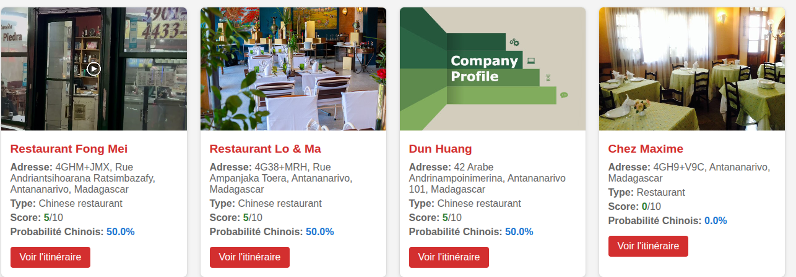

# exam1-2.0
# nouvelle version de l'examen précédent #
Sur L'examen précédent on a utilisé l'outils d'automatisation n8n pour avoir une partie des données mais là on combine avec un script python getData et on a enregistré dans les données brutes dans le fichier restaurants_antananarivo_with_links 

Après pour trouver les sites webs des restaurants recoltés on doit executer le script SearchWebsites qui génère un nouveau .csv complet cette fois ci

Enfin on fait le test dans le script testbis.py dans laquelle j'ai défini 3 critères:
*1-Type de cusine:Chinoise + 3 pts*
*2-Nom du restos ou du propriétaire avec des caractère ou nom chinois + 5 pts*
*3-Analyse des commentaires des clients si contient les mots clé en rapportt au cuisine chinoise + 2pts*
*une contrainte:Si le restaurants fait autres cuisine des autres pays -2pts*
A la fin on note chaque restos /10 et donne le pourcentage si il est vraiment chinois ou pas

le fichier html contient le resultat final

Comme d'habitude vous devez se connecter à serpApi.com 

